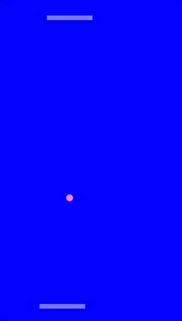
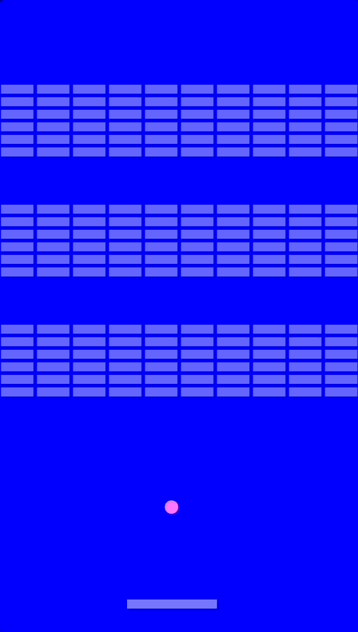
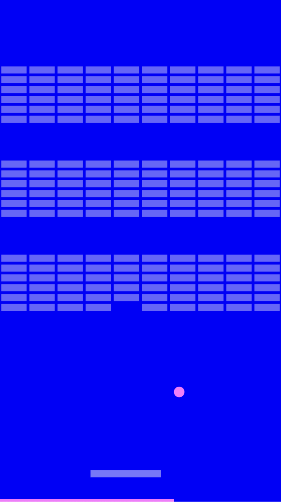

# *As Slow As Possible* Press Kit

## The basics
- Developer: [Pippin Barr](https://pippinbarr.com)
- Release: 25 March 2026
- Platform: Mobile and desktop
- Code repository: [https://github.com/pippinbarr/as-slow-as-possible/](https://github.com/pippinbarr/as-slow-as-possible/)
- Price: $0.00

## Description
*Slow down.*

*As Slow As Possible* is a set of three slow arcade games.

## History

I've been curious for quite a while about the relationships between games and time, games and attention, games and meditation. When I finished up [*It is as if you were on your phone*](https://pippinbarr.com/it-is-as-if-you-were-on-your-phone/info/) last year, one of the things I had to leave out was a sort of "zen mode" that would focus on the idea of having a meditative experience with your phone - leveraging the familiar interaction gestures, but leaving them empty so you could empty your mind. *As Slow As Possible* is partly a return to that, but from a new angle, taking familiar gameplay and slowing it down so much that time changes. I think the arcade nature of the underlying games does something to time in general (we all know what it feels like to lose time in a game) and then slowing it down does something else, maybe even something new?

## Technology
*As Slow As Possible* was created using [Phaser 3](https://phaser.io/) (for the game engine) and [Strudel](https://strudel.cc/) (for the music pattern language). The version of *Missile Command* in the game is based on [mslcmd](https://github.com/domdom82/mslcmd) by Dominik Froehlich ([domdom82](https://github.com/domdom82)).

*As Slow As Possible* is licensed under a [MIT License](https://opensource.org/license/mit). The license for mslcmd is available in its [folder in the repository](https://github.com/pippinbarr/as-slow-as-possible/tree/main/js/missilecommand).

## Features
- Balls
- Paddles
- Bricks
- Missiles
- Slowly

## GIFs

*Pong*

*Breakout*

*Missile Command*

## Images

*Pong*

*Breakout*

*Missile Command*

## Contact

- Email: [pippin.barr+press@proton.me](mailto:pippin.barr+press@proton.me)
- Website: [pippinbarr.com](https://pippinbarr.com)
- Bluesky: [@pippinbarr](https://bsky.app/profile/pippinbarr.bsky.social)